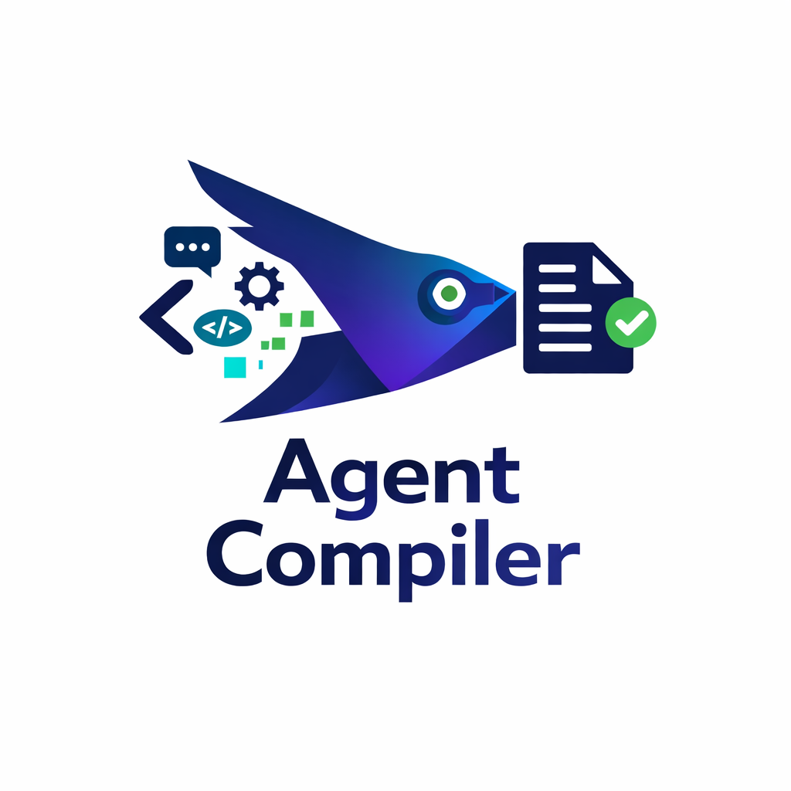

<div align="center">
  
</div>

# Agent Compiler

**Embed Claude Code skills and commands directly into CLAUDE.md/AGENTS.md for reliable agent behavior.**

Agent Compiler solves unreliable skill invocation by compiling your skills, agents, and commands directly into your configuration files where Claude Code consistently reads them.

## Why?

According to Vercel, [docs embedded in AGENTS.md outperform skills](https://vercel.com/blog/agents-md-outperforms-skills-in-our-agent-evals). Common issues with skills:

- Skills don't trigger even with correct phrases
- Inconsistent behavior across sessions
- CLAUDE.md/AGENTS.md instructions take priority over implied functionality

**Solution:** Embed skills directly where they work reliably.

## Installation

### One-time use with npx (recommended)

```sh
npx agent-compiler compile
```

### Global installation

```sh
npm install -g agent-compiler
agent-compiler compile
```

## Usage

Run the compiler in your project directory:

```sh
npx agent-compiler compile
```

The interactive wizard will:
1. Discover global (`~/.claude/skills/`) and local (`./.claude/skills/`) skills
2. Let you select which skills/commands to embed
3. Generate or update your CLAUDE.md or AGENTS.md with embedded content
4. Create automatic backups before any modifications

## How It Works

1. **Discovery**: Scans `~/.claude/skills/` (global) and `./.claude/skills/` (project) for skills/commands
2. **Selection**: Interactive multi-select for choosing what to embed
3. **Embedding**: Creates dedicated sections in CLAUDE.md/AGENTS.md
4. **Safety**: Automatic backups before modification with rollback on failure

### Output Structure

```md
# CLAUDE.md

Your existing CLAUDE.md content...

## SKILLS

### Skill Name
[Embedded skill content and invocation logic]

## COMMANDS

### Command Name
[Embedded command content]
```

The sectioned structure allows dynamic updates—you can re-run the compiler to add, remove, or update embedded content.

## Features

**Current:**
- ✅ Markdown-based skills, commands, and agents (global + local)
- ✅ Nested skill compilation (multi-file skills)
- ✅ Interactive TUI with multi-select
- ✅ Automatic backups and safe writes
- ✅ Dynamic section updates (re-run to modify embeds)

**Planned:**
- 🔲 Script-based skills (non-markdown)
- 🔲 Content compression for embedded skills
- 🔲 Selective embed management (add/remove individual items)

## Development

```sh
git clone https://github.com/antjanus/agent-compiler.git
cd agent-compiler
npm install
npm run build    # Build TypeScript
npm run dev      # Watch mode for development
```

### Contributing

This project uses [Conventional Commits](https://www.conventionalcommits.org/) for automated releases via semantic-release.

**Commit format:**
```
type(scope): description
```

**Common types:** `feat:`, `fix:`, `docs:`, `refactor:`, `test:`, `chore:`

1. Fork and create a feature branch (`feat/my-feature`)
2. Make changes using conventional commits
3. Open a PR against `main`

Releases are automated on merge to `main`—version bumping, CHANGELOG updates, and npm publishing happen automatically.

## License

MIT
